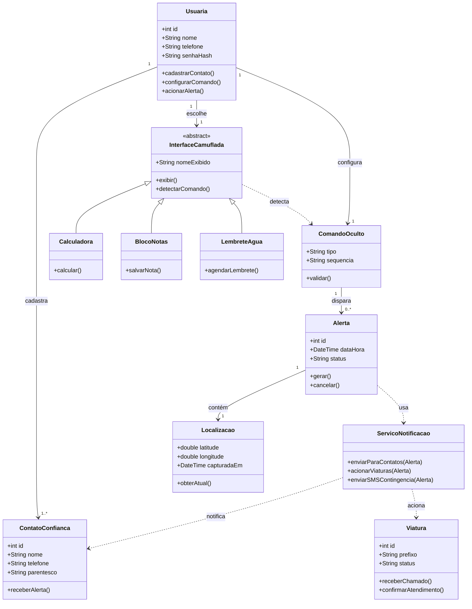

```mermaid
classDiagram
    class Usuaria {
        +int id
        +String nome
        +String telefone
        +String senhaHash
        +cadastrarContato()
        +configurarComando()
        +acionarAlerta()
    }

    class ContatoConfianca {
        +int id
        +String nome
        +String telefone
        +String parentesco
        +receberAlerta()
    }

    class InterfaceCamuflada {
        <<abstract>>
        +String nomeExibido
        +exibir()
        +detectarComando()
    }
    class Calculadora {
        +calcular()
    }
    class BlocoNotas {
        +salvarNota()
    }
    class LembreteAgua {
        +agendarLembrete()
    }

    class ComandoOculto {
        +String tipo
        +String sequencia
        +validar()
    }

    class Alerta {
        +int id
        +DateTime dataHora
        +String status
        +gerar()
        +cancelar()
    }

    class Localizacao {
        +double latitude
        +double longitude
        +DateTime capturadaEm
        +obterAtual()
    }

    class Viatura {
        +int id
        +String prefixo
        +String status
        +receberChamado()
        +confirmarAtendimento()
    }

    class ServicoNotificacao {
        +enviarParaContatos(Alerta)
        +acionarViaturas(Alerta)
        +enviarSMSContingencia(Alerta)
    }

    InterfaceCamuflada <|-- Calculadora
    InterfaceCamuflada <|-- BlocoNotas
    InterfaceCamuflada <|-- LembreteAgua

    Usuaria "1" --> "1..*" ContatoConfianca : cadastra
    Usuaria "1" --> "1" InterfaceCamuflada : escolhe
    Usuaria "1" --> "1" ComandoOculto : configura
    InterfaceCamuflada ..> ComandoOculto : detecta
    ComandoOculto "1" --> "0..*" Alerta : dispara
    Alerta "1" --> "1" Localizacao : contém
    Alerta ..> ServicoNotificacao : usa
    ServicoNotificacao ..> ContatoConfianca : notifica
    ServicoNotificacao ..> Viatura : aciona
```
