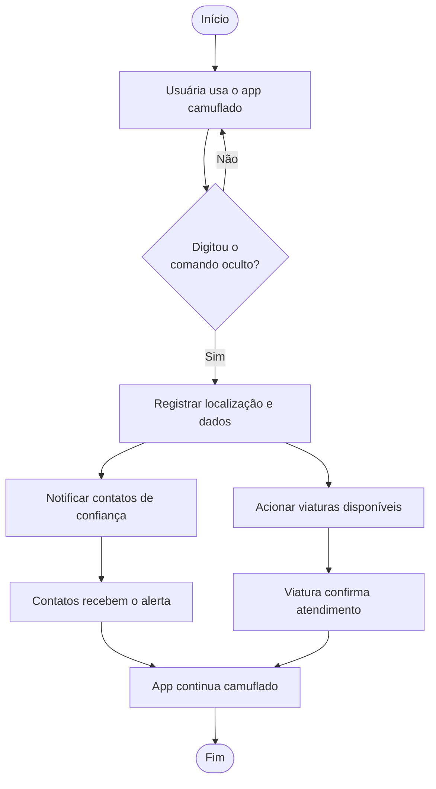

```mermaid
flowchart TD
    A([Início]) --> B[Usuária usa o app camuflado]
    B --> C{Digitou o<br/>comando oculto?}
    C -- Não --> B
    C -- Sim --> D[Registrar localização e dados]
    D --> E[Notificar contatos de confiança]
    D --> F[Acionar viaturas disponíveis]
    E --> G[Contatos recebem o alerta]
    F --> H[Viatura confirma atendimento]
    G --> I[App continua camuflado]
    H --> I
    I --> J([Fim])
```
