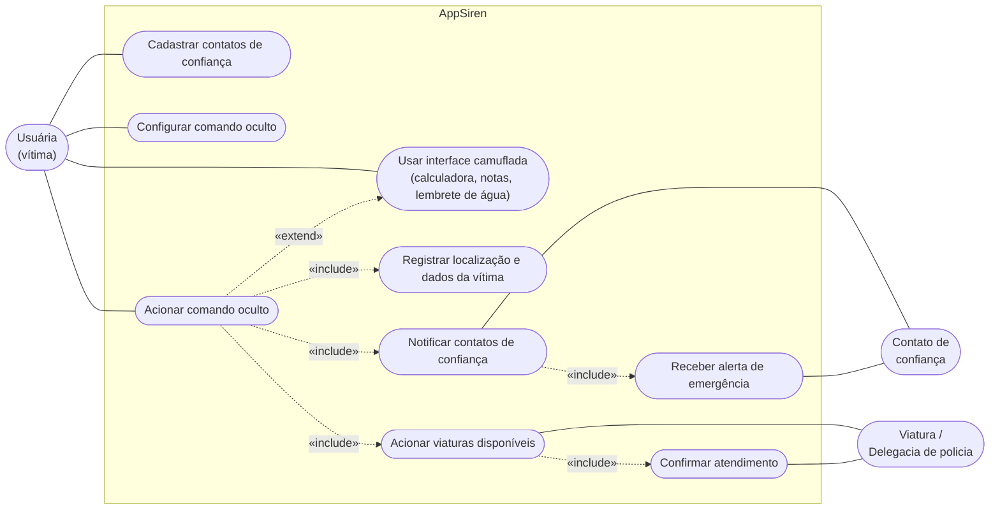

```mermaid
flowchart LR
    Usuaria([" Usuária<br/>(vítima)"])
    Contato([" Contato de<br/>confiança"])
    Viatura([" Viatura /<br/>Delegacia de policia"])

    subgraph Sistema["AppSiren"]
        UC1(["Usar interface camuflada<br/>(calculadora, notas, lembrete de água)"])
        UC2(["Cadastrar contatos de confiança"])
        UC3(["Configurar comando oculto"])
        UC4(["Acionar comando oculto"])
        UC5(["Registrar localização e dados da vítima"])
        UC6(["Notificar contatos de confiança"])
        UC7(["Acionar viaturas disponíveis"])
        UC8(["Receber alerta de emergência"])
        UC9(["Confirmar atendimento"])
    end

    Usuaria --- UC1
    Usuaria --- UC2
    Usuaria --- UC3
    Usuaria --- UC4

    UC4 -. "«include»" .-> UC5
    UC4 -. "«include»" .-> UC6
    UC4 -. "«include»" .-> UC7
    UC4 -. "«extend»" .-> UC1

    UC6 --- Contato
    UC8 --- Contato
    UC7 --- Viatura
    UC9 --- Viatura
    UC6 -. "«include»" .-> UC8
    UC7 -. "«include»" .-> UC9
```
