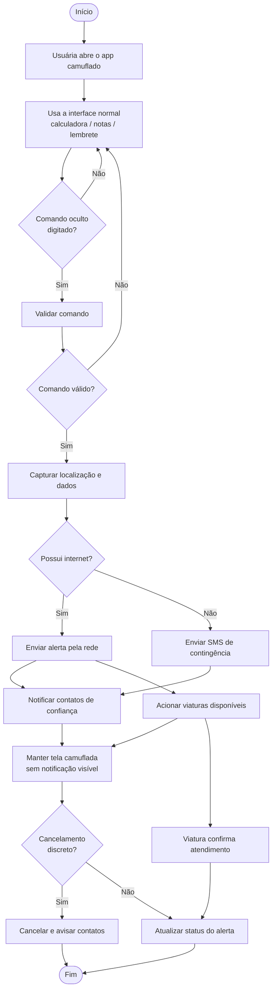

```mermaid
flowchart TD
    A([Início]) --> B[Usuária abre o app camuflado]
    B --> C[Usa a interface normal<br/>calculadora / notas / lembrete]
    C --> D{Comando oculto<br/>digitado?}
    D -- Não --> C
    D -- Sim --> E[Validar comando]
    E --> F{Comando válido?}
    F -- Não --> C
    F -- Sim --> G[Capturar localização e dados]
    G --> H{Possui internet?}
    H -- Sim --> I[Enviar alerta pela rede]
    H -- Não --> J[Enviar SMS de contingência]
    I --> K[Notificar contatos de confiança]
    I --> L[Acionar viaturas disponíveis]
    J --> K
    K --> M[Manter tela camuflada<br/>sem notificação visível]
    L --> M
    L --> N[Viatura confirma atendimento]
    N --> O[Atualizar status do alerta]
    M --> P{Cancelamento<br/>discreto?}
    P -- Sim --> Q[Cancelar e avisar contatos]
    P -- Não --> O
    Q --> R([Fim])
    O --> R
```
