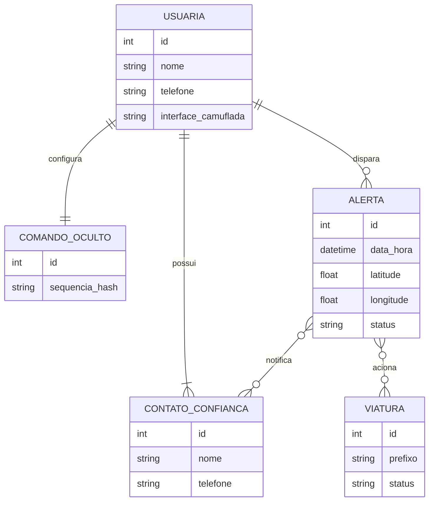

```mermaid
erDiagram
    USUARIA ||--|{ CONTATO_CONFIANCA : possui
    USUARIA ||--|| COMANDO_OCULTO : configura
    USUARIA ||--o{ ALERTA : dispara
    ALERTA }o--o{ CONTATO_CONFIANCA : notifica
    ALERTA }o--o{ VIATURA : aciona

    USUARIA {
        int id 
        string nome
        string telefone
        string interface_camuflada
    }
    CONTATO_CONFIANCA {
        int id 
        string nome
        string telefone
    }
    COMANDO_OCULTO {
        int id 
        string sequencia_hash
    }
    ALERTA {
        int id 
        datetime data_hora
        float latitude
        float longitude
        string status
    }
    VIATURA {
        int id 
        string prefixo
        string status
    }
```
