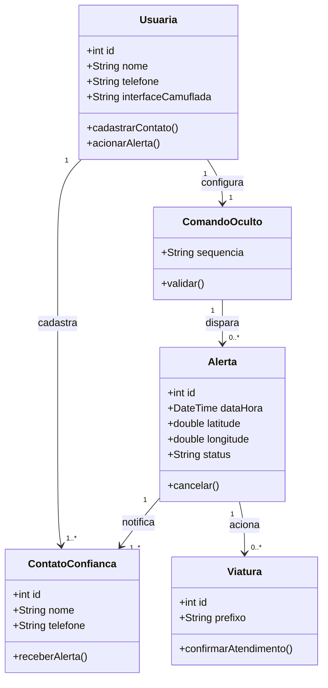

```mermaid
classDiagram
    class Usuaria {
        +int id
        +String nome
        +String telefone
        +String interfaceCamuflada
        +cadastrarContato()
        +acionarAlerta()
    }

    class ContatoConfianca {
        +int id
        +String nome
        +String telefone
        +receberAlerta()
    }

    class ComandoOculto {
        +String sequencia
        +validar()
    }

    class Alerta {
        +int id
        +DateTime dataHora
        +double latitude
        +double longitude
        +String status
        +cancelar()
    }

    class Viatura {
        +int id
        +String prefixo
        +confirmarAtendimento()
    }

    Usuaria "1" --> "1..*" ContatoConfianca : cadastra
    Usuaria "1" --> "1" ComandoOculto : configura
    ComandoOculto "1" --> "0..*" Alerta : dispara
    Alerta "1" --> "1..*" ContatoConfianca : notifica
    Alerta "1" --> "0..*" Viatura : aciona
```
